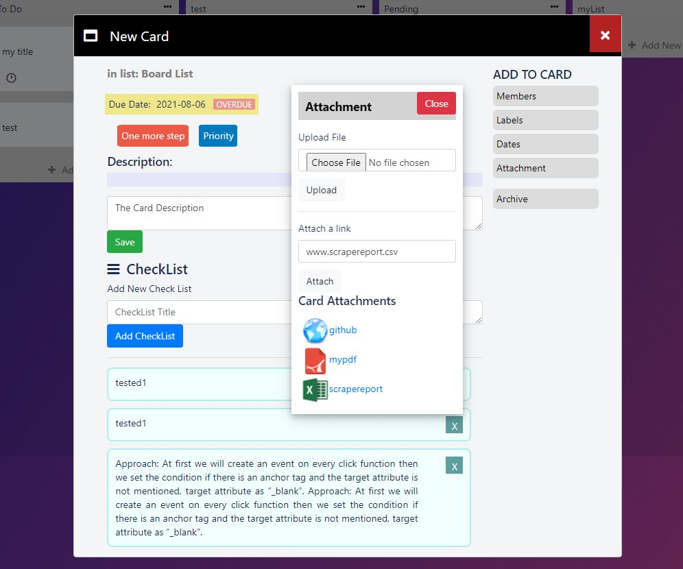

# trello
UI/UIX similar to Trello, all actions required this example is Bootstrap, HTML5, CSS3,  JavaScript only not added backend. app has drag and drop system, add new cards, create new labels, create new list, effects, search labels (Full Responsive using Trello way and flexbox, bootstrap) the app is lightweight, and depend on JavaScript and AJAX and HTML5 with very less database calls to make it faster, and it contains only 3 database tables and one table only for all card functions that holds checklists and labels and everything I used new technique I made like cookies to save the data in HTML data-attributes with custom functions to update and select and display and convert the strings to checklists or labels, archive and attachments that help to reduce database tables, alot of server requests and database calls + it light weight cus large features only come from single string instead of mini tables and groupded SQL queires it can be modifed to be working using webstorage without even database, with only 400 lines maximum PHP that cover 14 requests and render HTML, + it same responsive like trello and have some small things trello not have it.

## features 

